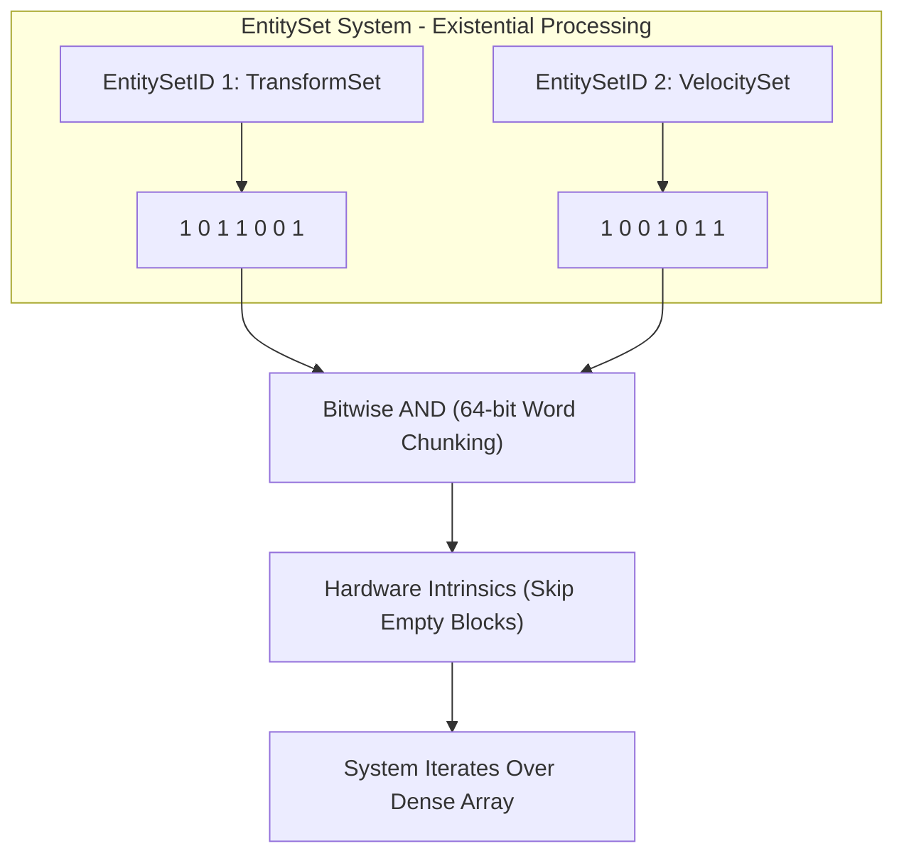

# SibbEngine
## A Multi-Platform C++ Game Engine

An overview of the core architectural decisions behind SibbEngine; a custom, high-performance C++ engine built around a Sparse-Dense ECS Architecture and **Data-Oriented Design (DOD)** principles. 

---

## Introduction & Design Philosophy

When building complex real-time game systems, relying on large commercial engines often introduces friction. Complex abstractions and opaque internal state force developers to make assumptions about execution flow, leading to unexpected runtime behavior and architectural workarounds. Rather than spending time fighting external black boxes or studying documentation for systems built under different architectural goals, building an engine from the ground up ensures every subsystem remains fully visible, fully configurable, and engineered down to the hardware level.

The core architecture adheres to these primary guidelines:

* **Performance via Simplicity:** Performance and reliability stem directly from simplicity—where simple means robust rather than basic. Complex runtime bugs and performance bottlenecks are rarely solved by adding layers of indirection; spending time designing straightforward data layouts upfront yields software that is deterministic and easy to reason about.
* **The Primacy of Flat Arrays:** Complex, pointer-heavy data structures are often an unnecessary abstraction. In modern computing, execution speed is dictated by memory layout. The core storage mechanisms in this engine rely on flat, contiguous arrays to maximize CPU cache utilization and hardware prefetching.
* **Fine-Grained Data Decomposition:** Rather than defaulting to monolithic structs, complex data (such as transforms) can be split into lean arrays based on access frequency—for instance, separating position vectors from orientation data. This allows performance-critical systems to iterate strictly over the required bytes, optimizing memory throughput per pass.
* **Architecture over Indirection:** Poor design cannot be masked by clever runtime patches. By structuring data flows cleanly before writing execution logic, system transformations remain simple, maintainable, and low-latency.
* **Separation of Data and Execution:** Data-Oriented Design treats code as transformations applied to streams of data. Decoupling entity identities, component storage, and system logic eliminates hidden allocation overhead and maintains a predictable execution pipeline.

---

## Architectural Highlights

* **Cache-Friendly Component Storage:** Utilizes sparse-dense mapping to guarantee packed, contiguous arrays for system update loops.
* **Bitwise Filtering (EntitySets):** Employs uniform bitsets managed by a central system to evaluate entity signatures instantly via bitwise operations.
* **Resource Management via Handles:** Prefabs manage heavy resource loading (textures, meshes) while runtime entities retain lightweight resource handles.

---

## Core Systems Breakdown

### 1. EntitySet System & Filtering

Rather than adopting an Archetype-based layout (which requires moving component data across tables when entity signatures change), existential processing is handled by using a custom bitset abstraction: **EntitySets**.

* **Centralized Scaling:** An `EntitySetSystem` manages all bitsets, ensuring uniform sizing across the runtime while dispensing opaque `EntitySetID` handles.
* **Bit Index = Entity ID:** The bit index within an `EntitySet` maps directly to an `EntityID`.
* **Sparse Indexing:** `EntitySets` act as the sparse side of component and tag storage, allowing operations to quickly isolate active entities.
* **Hardware-Accelerated Bitset Intrinsics:** Storing flags in unified bitsets allows filtering to execute across 64-bit machine-word chunks. By leveraging CPU intrinsics to scan set bits, entire empty entity blocks can be skipped in single instructions, allowing iteration overhead to be virtually eliminated before reaching the update loop.
* **Generational Handle Safety:** Entity IDs combine a 32-bit sparse index with a 32-bit generation counter. While system update loops iterate purely over packed dense arrays without validation overhead, persistent references (e.g., AI targets, script handles) validate against a flat generation array in $O(1)$ time to prevent stale accesses when entity indices are recycled via the free-list.


```cpp
void Render2DSystem::Update(float dt)
{
    EntitySetSystem* ess = entityManager->entitySetSystem;
    BackendRenderer* renderer = this->renderer->backendRenderer;

    //-----ENTITY SETS-----
    EntitySetID sprites_setActive = entityManager->tags_runtime.GetActiveSetHandle(TAG_RUNTIME::SPRITE_SET_ACTIVE);
    EntitySetID sprites_isActive  = entityManager->tags_runtime.GetActiveSetHandle(TAG_RUNTIME::SPRITE_IS_ACTIVE);
    EntitySetID wt2d_pos_dirty    = entityManager->worldTransforms2D_pos.GetDirtySetHandle();

    //-----SET ACTIVE/INACTIVE-----
    LocalEntitySet setActive = ess->GetScratchpadA();
    ess->OpDifference(setActive, sprites_setActive, sprites_isActive);
    for (uint32_t internalIdx : ess->Iterate(setActive)) {
        for (auto rib : entityManager->ecsSpriteInstances.GetByInternalIndex(internalIdx).renderables)
            renderer->SetActive(rib, true);
    }

    LocalEntitySet setInactive = ess->GetScratchpadB();
    ess->OpAnd(setInactive, sprites_setActive, sprites_isActive);
    for (uint32_t internalIdx : ess->Iterate(setInactive)) {
        for (auto rib : entityManager->ecsSpriteInstances.GetByInternalIndex(internalIdx).renderables)
            renderer->SetActive(rib, false);
    }

    // Resolve tags
    ess->OpUnionInline(sprites_isActive, setActive);
    ess->OpDifference(sprites_isActive, sprites_isActive, setInactive);
    ess->Clear(sprites_setActive);

    //-----POSITION TRANSFORM DATA-----
    LocalEntitySet dirty_sprites = ess->GetScratchpadA();
    ess->OpAnd(dirty_sprites, sprites_isActive, wt2d_pos_dirty);
    for (uint32_t internalIdx : ess->Iterate(dirty_sprites)) {
        auto& wt = entityManager->worldTransforms2D_pos.GetByInternalIndex(internalIdx);
        auto& sp = entityManager->ecsSpriteInstances.GetByInternalIndex(internalIdx);
        for (auto rib : sp.renderables) {
            renderer->UpdateInstance(rib, InstanceLayouts::Sprite::ID::Pos_Rot, &wt.position);
        }
    }

    // ...
}
```
**Implementation Note:** The OpAnd operation filters active entities against dirty handles before looping, ensuring iteration only touches entities that actually need GPU buffer updates while skipping inactive blocks entirely.

---

### 2. Component Storage: Sparse-Dense Mapping

To keep system execution fast and eliminate cache misses, components are stored in packed, contiguous memory arrays (Dense side).

1. **Filtering:** The system queries the `EntitySetSystem` using bitwise logic to retrieve a sparse bitmask of qualifying entities.
2. **Dense Lookup:** Valid `EntityIDs` map directly to continuous component slots in the dense array.
3. **Execution:** Systems process the dense array sequentially, benefiting from CPU prefetching and zero dynamic allocations during runtime update loops.
4. **$O(1)$ Removal via Swap-and-Pop:** Component removal swaps the target element with the last active entry in the dense array before clearing it. This maintains zero memory gaps and avoids costly array shifts without breaking contiguous cache alignment.

---

### 3. Prefab Instantiation & "Skewer" Model

Entities are abstract identifiers, an entity can be seen as an empty skewer onto which components are applied, much like sliding chunks of meat and vegetables onto a stick.
Prefabs function essentially the same; they are abstract handles mapping to prefab components, acting as the "recipe" for how an entity "skewer" should be assembled. 
Prefab components are basically serializable versions of entity components that hold default values and resource filepaths.

* **Sequential Application:** Applying a prefab to an entity allocates missing components or overwrites existing values.
* **Prefab Variants & Overrides:** Variants require no special inheritance logic. They are resolved by applying multiple prefabs sequentially, where execution order dictates overrides.
* **Resource Handles:** Heavy assets (textures, meshes, audio) are loaded once upon loading a Prefab into memory. Entities receive lightweight handles, keeping memory footprints minimal.

---

## System Execution & Lifetime Operations

* **Explicit Pipeline Execution:** Systems execute sequentially in a fixed, deterministic update loop. System dependencies (e.g., hierarchy transforms resolving prior to camera and render passes) are managed via explicit call order in the main engine loop, eliminating runtime scheduling overhead.
* **Tag-Driven Deferred Operations:** Structural modifications such as adding or removing entities and components are deferred using lightweight tag components. Rather than mutating contiguous arrays mid-iteration, tags mark entities for processing, allowing lifetime operations (such as renderable registration or entity removal) to be safely flushed in batch passes at designated points in the loop.

---

## Technical Summary

| Feature | Implementation | Engineering Benefit |
| :--- | :--- | :--- |
| **Data Layout** | Sparse-Dense Mapping | Eliminates memory fragmentation; enables CPU cache prefetching |
| **Existential Processing** | Uniform Bitsets (`EntitySetSystem`) | Fast signature filtering via 64-bit word chunking and CPU intrinsics to skip empty entity space and only process relevant data |
| **Entity Safety** | Generational IDs & Free-List | $O(1)$ index recycling; safe detection of stale handles for cross-frame references without overhead in batch loops |
| **Component Removal** | Swap-and-Pop Strategy | $O(1)$ deletion time without array reordering or dynamic reallocations |
| **Instantiation** | Layered Prefab Application | Modular data composition without class hierarchy overhead |
| **Memory Allocation** | Contiguous Component Blocks | Zero dynamic allocation cost during update loops |
| **System Scheduling** | Explicit Sequential Pipeline | Zero runtime scheduler overhead; guaranteed, deterministic execution order |
| **Deferred Operations** | Tag-Based State Flushes | Prevents component array mutation and index invalidation during active system loops |

---

## Author

**5ibben**  
*Game Developer / Engine Programmer*  
[GitHub Profile](https://github.com/5ibben)
